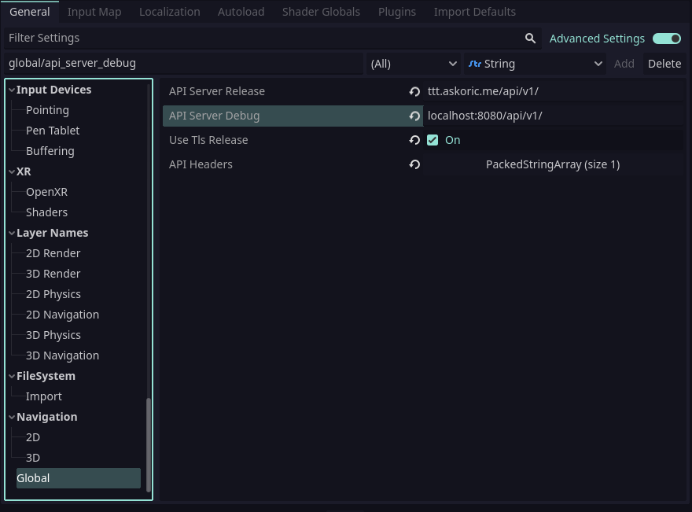

<a name="readme-top"></a>

<!-- [![Stargazers][stars-shield]][stars-url] -->
<!-- [![Issues][issues-shield]][issues-url] -->
<!-- ![Tokei][tokei-shield] -->
[![MIT License][license-shield]][license-url]
[![LinkedIn][linkedin-shield]][linkedin-url]

<!-- PROJECT LOGO -->
<br />
<div align="center">
  <a href="https://github.com/ace-skoric/ttt-client">
    
  </a>

<h3 align="center">Tic Tac Toe</h3>

  <p align="center">
    Example client
    <br />
    <br />
    <a href="https://ttt.askoric.me">Live Demo</a>
    ·
    <a href="https://github.com/ace-skoric/ttt-server">Server Repo</a>
    ·
    <a href="https://github.com/ace-skoric/ttt-client/issues">Report Bug</a>
    ·
    <a href="https://github.com/ace-skoric/ttt-client/issues">Request Feature</a>
  </p>
</div>

<!-- TABLE OF CONTENTS -->
<details>
  <summary>Table of Contents</summary>
  <ol>
    <li>
      <a href="#about-the-project">About The Project</a>
    </li>
    <li><a href="#setup">Setup</a></li>
    <li><a href="#roadmap">Roadmap</a></li>
    <li><a href="#license">License</a></li>
    <li><a href="#contact">Contact</a></li>
    <li><a href="#acknowledgments">Acknowledgments</a></li>
  </ol>
</details>

<!-- ABOUT THE PROJECT -->
## About The Project

Client for a simple [Tic-Tac-Toe (Noughts and Crosses)](https://en.wikipedia.org/wiki/Tic-tac-toe) game made with [Godot game engine](https://godotengine.org/).

You can check out server part at <https://github.com/ace-skoric/ttt-server>.

You can download game from [releases](https://github.com/ace-skoric/ttt-client/releases) or check out live web demo at <https://ttt.askoric.me>.

Currently only Windows and Linux binaries are released with the plans to realease MacOS and Android in near future.

<p align="right">(<a href="#readme-top">back to top</a>)</p>

<!-- SETUP -->
## Setup

To setup local developing environment all you need to have is Godot v4.0-beta6 which you can get from [here](https://downloads.tuxfamily.org/godotengine/4.0/beta6/).

- Clone this repo

    ```sh
    git clone https://github.com/ace-skoric/ttt-client.git
    ```

- Open up Godot and import this project

- [Run server locally](https://github.com/ace-skoric/ttt-server)

- Under `Project` &rarr; `Project Settings` &rarr; `Globals` set `API Server Debug` to point at your server instance

  

- Now you can run the game

<p align="right">(<a href="#readme-top">back to top</a>)</p>

<!-- ROADMAP -->
## Roadmap

- [ ] Add some sound effects
- [ ] Reconnecting to game
- [ ] Solo play vs AI mode
- [ ] Automated tests
- [ ] CI/CD

<p align="right">(<a href="#readme-top">back to top</a>)</p>

<!-- LICENSE -->
## License

Distributed under the MIT License. See `LICENSE` file for more information.

<p align="right">(<a href="#readme-top">back to top</a>)</p>

<!-- CONTACT -->
## Contact

Aleksandar Skoric - askoric@protonmail.com

Project Link: [https://github.com/ace-skoric/ttt-client](https://github.com/ace-skoric/ttt-client)

<p align="right">(<a href="#readme-top">back to top</a>)</p>

<!-- ACKNOWLEDGMENTS -->
## Acknowledgments

[Icon created by Freepik](https://www.flaticon.com/free-icons/tic-tac-toe)

[Catppucin](https://github.com/catppuccin/catppuccin/) - Colorscheme

<p align="right">(<a href="#readme-top">back to top</a>)</p>
<!-- MARKDOWN LINKS & IMAGES -->

<!-- https://www.markdownguide.org/basic-syntax/#reference-style-links -->
[contributors-shield]: https://img.shields.io/github/contributors/ace-skoric/ttt-client.svg?style=flat
[contributors-url]: https://github.com/ace-skoric/ttt-client/graphs/contributors
[forks-shield]: https://img.shields.io/github/forks/ace-skoric/ttt-client.svg?style=flat
[forks-url]: https://github.com/ace-skoric/ttt-client/network/members
[stars-shield]: https://img.shields.io/github/stars/ace-skoric/ttt-client.svg?style=flat
[stars-url]: https://github.com/ace-skoric/ttt-client/stargazers
[issues-shield]: https://img.shields.io/github/issues/ace-skoric/ttt-client.svg?style=flat
[issues-url]: https://github.com/ace-skoric/ttt-client/issues
[license-shield]: https://img.shields.io/github/license/ace-skoric/ttt-client.svg?style=flat
[license-url]: https://github.com/ace-skoric/ttt-client/blob/master/LICENSE
[linkedin-shield]: https://img.shields.io/badge/-LinkedIn-black.svg?style=flat&logo=linkedin&colorB=555
[linkedin-url]: https://linkedin.com/in/askoric
[tokei-shield]: https://img.shields.io/tokei/lines/github/ace-skoric/ttt-client